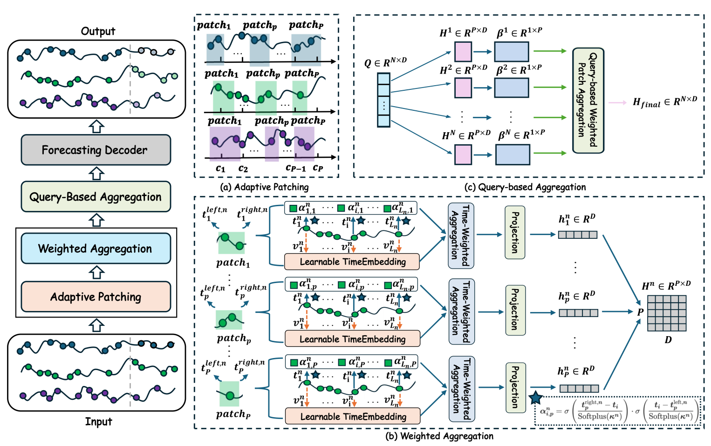
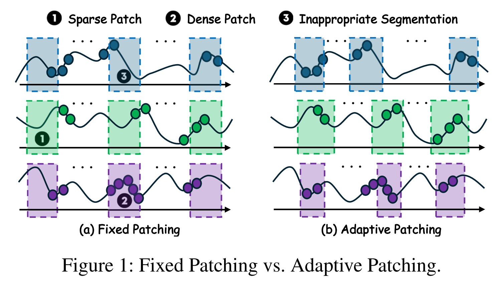
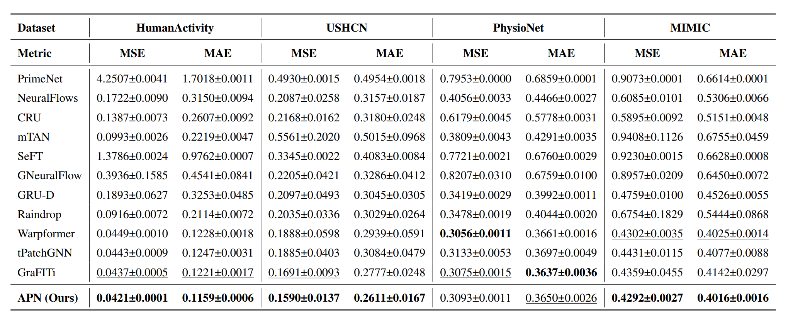
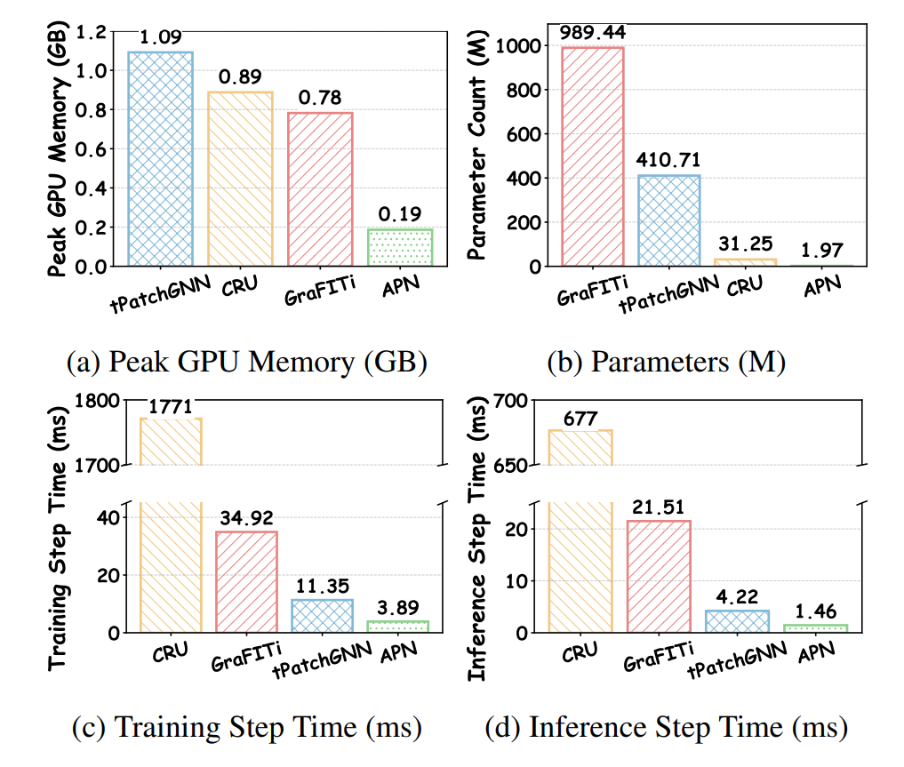
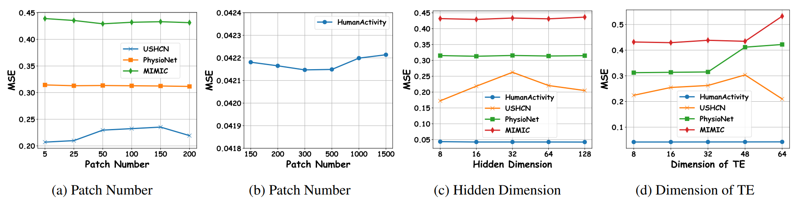

# APN: Rethinking Irregular Time Series Forecasting

[](https://arxiv.org/abs/2505.11250)  [](https://www.python.org/)  [](https://pytorch.org/)  

This code is the official PyTorch implementation of our AAAI'26 paper: [APN](https://arxiv.org/abs/2505.11250): Rethinking Irregular Time Series Forecasting: A Simple yet Effective Baseline.

🚩 News (2025.12) APN has been accepted by **AAAI 2026**.

## Repository Status

This repository is runnable in the current workspace, but the irregular-data preprocessing path is not yet a faithful reproduction of the paper protocol for every dataset.

- End-to-end APN training and testing has been verified locally.
- The main reproducibility issue is preprocessing mismatch rather than a model crash.
- In particular, the current P12 and MIMIC-III paths contain normalization behavior that is not suitable for fair paper-level comparison.

For the current reproduction status, confirmed discrepancies, and next-step fixes, see [REPRODUCTION_DISCREPANCIES.md](./REPRODUCTION_DISCREPANCIES.md).

## Introduction

**APN** (Adaptive Patching Network), which introduces a novel <ins>**A**</ins>daptive <ins>**P**</ins>atching paradigm to rethink irregular multivariate time series forecasting. Specifically, it designs a **Time-Aware Patch Aggregation (TAPA)** module that learns dynamically adjustable patch boundaries and employs a time-aware weighted averaging strategy. This transforms irregular sequences into high-quality, regularized representations in a channel-independent manner. Equipped with a simple query module and a shallow MLP, APN effectively integrates historical information while maintaining high efficiency.

<div align="center">

</div>

The comparisons between Fixed Patching and our Adaptive Patching: (a) Fixed Patching vs. (b) Adaptive Patching.
<div align="center">

</div>


## Quickstart

> [!IMPORTANT]
> The original repository recommendation is Python 3.11.13. In this workspace, the APN pipeline has also been verified to run under Python 3.12.9 with Torch 2.9.1 and CUDA available.

### 1. Requirements

Given a python environment, install the dependencies with the following command:

```shell
pip install -r requirements.txt
```

In the current workspace, the successful verification run only required adding missing packages rather than downgrading the whole environment.

### 2. Data Preparation

APN includes four irregular time series benchmarks in the current codebase: **PhysioNet 2012 (P12)**, **MIMIC-III**, **HumanActivity**, and **USHCN**. The loading path is not identical across datasets, and the current preprocessing behavior matters for reproducibility.

#### 2.1 Public Datasets (Auto-Download)
For **HumanActivity**, **PhysioNet 2012**, and **USHCN**, the project can prepare data automatically on first use, but the storage locations differ.

- **HumanActivity**: The script will automatically download and process the data. The processed files will be stored in:
  ```
  ./storage/datasets/HumanActivity
  ```
- **PhysioNet 2012 & USHCN**: These datasets are managed via the vendored `tsdm` path and are cached under your home directory:
  ```
  ~/.tsdm/datasets/  # Processed data
  ~/.tsdm/rawdata/   # Raw data
  ```

Current code note:

- P12 currently uses `Standardizer()` for feature values and `MinMaxScaler()` for time inside `data/dependencies/tsdm/tasks/P12.py`.
- That value standardization is fitted on the full dataset rather than the training split only, so current P12 results are affected by data leakage.

#### 2.2 MIMIC Dataset
Due to privacy regulations, the **MIMIC** dataset requires credentialed access. Please follow the steps below to prepare it manually:

1.  **Request Access**: Obtain the raw data from [MIMIC](https://physionet.org/content/mimiciii/1.4/). You do not need to extract the `.csv.gz` files.
2.  **Preprocessing**: The current APN code expects the `gru_ode_bayes` preprocessing output `complete_tensor.csv`.
    - Clone the [gru_ode_bayes](https://github.com/edebrouwer/gru_ode_bayes/tree/master/data_preproc/MIMIC) repository.
    - Follow their instructions to generate the `complete_tensor.csv` file.
3.  **File Placement**: Move the generated `complete_tensor.csv` to the specific path expected by our dataloader (create folders if they don't exist):

```bash
mkdir -p ~/.tsdm/rawdata/MIMIC_III_DeBrouwer2019/
mv /path/to/your/complete_tensor.csv ~/.tsdm/rawdata/MIMIC_III_DeBrouwer2019/
```

Once the file is in place, our code will handle the final formatting (generating `.parquet` files) automatically during the first training session.

Current code note:

- The APN MIMIC path consumes `VALUENORM` from `complete_tensor.csv`.
- In the current pipeline, that normalized value path is derived from full-dataset statistics upstream of APN training.
- This means current MIMIC results should not be treated as a clean train-only-normalized reproduction.

### 2.3 Reproducibility Note on Normalization

The main reproduction gap in this repository is the normalization protocol for irregular datasets.

- `t-PatchGNN` comparisons typically assume train-set-fitted Min-Max normalization for relevant datasets.
- The current APN code path does not match that behavior consistently.
- Planned follow-up work is to add explicit normalization modes for irregular datasets, including:
  - no normalization
  - train-only normalization

Those options are not fully implemented yet. See [REPRODUCTION_DISCREPANCIES.md](./REPRODUCTION_DISCREPANCIES.md) before interpreting P12 or MIMIC results as paper-level comparisons.

### 3. Train and evaluate model

- To see the model structure of APN, [click here](./models/APN.py).
- We provide experiment scripts for APN and multiple baselines under `./scripts`.
- The scripts are runnable, but some irregular-dataset scripts are not yet protocol-aligned with the paper comparisons.
- For a verified local APN run, the P12 launcher is the clearest starting point:

```shell
chmod +x ./scripts/APN/P12.sh
./scripts/APN/P12.sh
```

For a shorter local validation run:

```shell
RUN_PROFILE=medium ./scripts/APN/P12.sh
```

## Results

### Main Results
The paper reports strong results on PhysioNet, MIMIC, HumanActivity, and USHCN. However, the current repository state in this workspace should be interpreted with care:

- the APN pipeline runs successfully
- the current preprocessing path is not fully aligned with the official `t-PatchGNN` protocol
- therefore, local reruns should not be assumed to match the paper tables without further preprocessing fixes

<div align="center">

</div>

Local verified status in this workspace:

- P12 medium-profile run completed successfully
- observed metrics were `MAE = 0.37021493911743164`, `MSE = 0.3146660625934601`
- these values confirm executability, not faithful paper-level reproducibility

### Efficiency Analysis
Comparison of computational efficiency on the USHCN dataset. APN exhibits significant advantages in **Peak GPU Memory**, **Parameters**, **Training Time**, and **Inference Time**.

<div align="center">

</div>

### Parameter Sensitivity
Results of parameter sensitivity analysis on the number of patches ($P$), hidden dimension ($D$), and time encoding dimension ($D_{te}$).

<div align="center">

</div>

## Citation

If you find this repo useful, please cite our paper.

```bibtex
@inproceedings{liu2026apn,
 title     = {Rethinking Irregular Time Series Forecasting: A Simple yet Effective Baseline},
 author    = {Xvyuan Liu and Xiangfei Qiu and Xingjian Wu and Zhengyu Li and Chenjuan Guo and Jilin Hu and Bin Yang},
 booktitle = {AAAI},
 year      = {2026}
}
```

## Acknowledgement

This work was partially supported by the National Natural Science Foundation of China (No.62472174) and the Fundamental Research Funds for the Central Universities.

**We appreciate the following GitHub repos a lot for their valuable code and efforts.**

Pyomnits (https://github.com/Ladbaby/PyOmniTS)

## Contact

If you have any questions or suggestions, feel free to contact:

- Xvyuan Liu (xvyuanliu@stu.ecnu.edu.cn)
- [Xiangfei Qiu](https://qiu69.github.io/) (xfqiu@stu.ecnu.edu.cn)
- Xingjian Wu (xjwu@stu.ecnu.edu.cn)

Or describe it in Issues.
